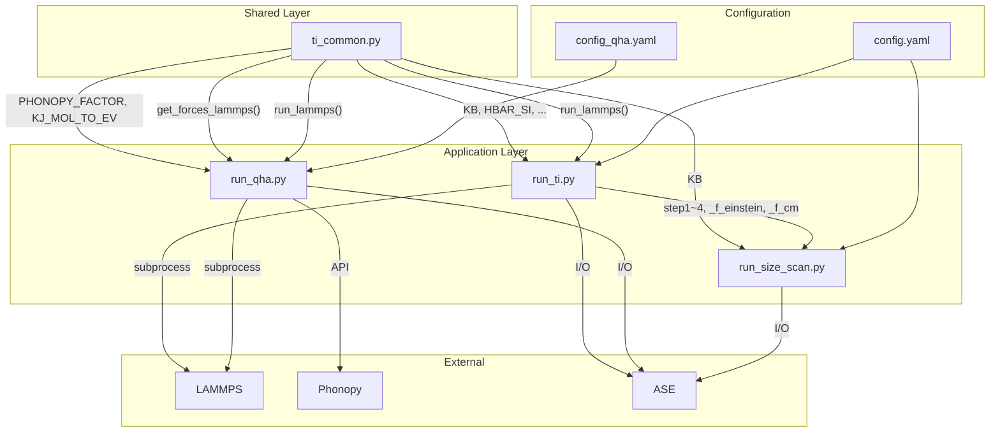

# 고체상(Solid Phase) 자유에너지 계산 및 LAMMPS 구현의 완벽 가이드

## 문서 목적
본 문서는 고체상의 자유에너지(Free Energy)를 계산하기 위한 이론적 배경과 **LAMMPS** 기반의 실무 구현 방법론을 집대성한 가이드입니다. **Phonon 기반 방식(Phonopy, VACF)**과 **열역학적 적분(Thermodynamic Integration, TI)**의 양대 산맥을 비교 분석하며, 특히 최근 각광받는 **Reversible Scaling (RS)** 구현체(`nonequilibrium`, `calphy`)에 대한 심층 비교와 복잡한 포텐셜(SW, MLIP 등) 적용 시의 주의사항을 상세히 다룹니다.

---

# 제1장: 자유에너지의 기본 정의

## 1.1 Helmholtz 자유에너지
정온정적 앙상블(NVT)에서 계 전체의 Helmholtz 자유에너지 $F$ 는 분배 함수(Partition Function) $Z$ 를 통해 다음과 같이 정의됩니다.
$$
F(T,V,N) = -k_B T \ln Z(T,V,N)
$$
여기서 분배 함수 $Z$ 는 계가 가질 수 있는 모든 미시 상태에 대한 볼츠만 인자($e^{-\beta H}$)의 합(위상 공간 적분)으로 주어집니다.
$$
Z = \frac{1}{h^{3N} N!} \int d\mathbf{p}\, d\mathbf{r} \, e^{-\beta H(\mathbf{p},\mathbf{r})}
$$
해밀토니안 $H(\mathbf{p},\mathbf{r})$ 은 운동 에너지 $K(\mathbf{p})$ 와 퍼텐셜 에너지 $U(\mathbf{r})$ 의 합으로 구성됩니다. 이 중 운동 에너지 적분은 이상기체와 동일하게 해석적으로 쉽게 풀리지만, **$3N$ 개의 원자 좌표가 모두 얽혀 있는 퍼텐셜 에너지 적분 $\int d\mathbf{r} \, e^{-\beta U(\mathbf{r})}$ 은 다체 문제(Many-body problem)의 특성상 복잡한 분자나 고체에 대해 해석적으로 구하는 것이 불가능합니다.**

따라서 자유에너지를 구하기 위해 고체물리와 통계역학에서는 크게 두 가지 우회로를 채택합니다.
1. **Phonon 방법(제2장)**: 원자들이 평형 위치에서 아주 작게 진동한다고 가정(조화 진동자)하여 퍼텐셜을 2차 식까지만 근사하고 적분 문제를 해석적으로 풉니다.
2. **열역학적 적분법(제3장)**: 자유에너지를 알고 있는 가상의 기준계(Reference System)를 도입하여, 기준계에서 목표계로 점진적으로 변화시킬 때 발생하는 에너지 차이(또는 일)를 시뮬레이션을 통해 직접 적분합니다.

## 1.2 Gibbs 자유에너지
압력이 고정된 조건에서는 Gibbs 자유에너지를 사용합니다. 실제 계산에서는 여러 부피 $V$ 에 대해 $F(T,V)$ 를 계산한 뒤, 상태 방정식을 피팅하여 평형 상태를 도출합니다 (준조화 근사, QHA).
$$
G(T,P) = \min_V [F(T,V) + PV]
$$

---

# 제2장: Phonon 기반 계산 방식 (조화 및 준조화 근사)

Phonon 기반 방식은 고체의 진동을 양자역학적 조화 진동자(Harmonic oscillator)의 집합으로 모델링하며, 비교적 적은 계산 비용으로 온도에 따른 자유에너지 곡선을 얻을 수 있습니다.

## 2.1 분자 동역학 기반: 속도 자기상관함수 (LAMMPS `compute vacf`)
유한온도 MD 궤적에서 속도 자기상관함수(VACF) $C_{vv}(t)$ 를 추출하고, 이를 푸리에/코사인 변환하여 유효 상태 밀도 $\tilde g(\omega)$ 를 도출하는 통계역학적 접근입니다.

* **구현 절차**:
  1. 목표 온도/부피에서 완벽히 평형화한 후, 온도 제어기(Thermostat)의 인공 감쇠를 피하기 위해 **NVE 앙상블**로 전환합니다.
  2. `compute vacf`를 사용하여 시계열 데이터를 아주 짧은 timestep(0.5~1.0 fs)으로 길게 수집합니다.
  3. 후처리를 통해 $C_{vv}(t)$를 변환하여 $\tilde g(\omega)$를 얻고, 이를 적분 공식에 대입하여 $F_{\mathrm{vib}}$를 산출합니다.

* **특장점**: 실제 온도에서의 비조화성(anharmonicity)이 일부 포함된 유효 진동 특성을 반영할 수 있으며 구현이 직관적입니다. 하지만 엄밀한 phonon free energy와는 약간의 해석적 차이가 존재합니다.

## 2.2 결정 역학 기반: 유한 변위법 (Phonopy + LAMMPS)
결정 구조에서 원자를 미세하게 이동시켰을 때 발생하는 복원력을 계산하여 힘 상수 행렬(Force Constant Matrix)을 구성하는 교과서적인 접근입니다.

* **구현 절차**:
  1. **구조 최적화**: LAMMPS `minimize`로 초기 구조의 Net force를 $10^{-10}$ 수준까지 완벽히 제거합니다.
  2. **슈퍼셀 생성**: Phonopy를 이용해 대칭성에 기반한 미세 변위(약 0.01Å)가 인가된 여러 개의 충분히 큰 슈퍼셀을 생성합니다.
  3. **단일 점 힘 계산**: LAMMPS에서 각 구조를 읽은 후, 시간 적분 없이(`run 0`) 원자에 작용하는 힘 트랙토리를 기록합니다. **(Relax 불가)**
  4. **상태 밀도 도출**: Phonopy를 통해 $g(\omega)$와 열역학적 속성(`thermal_properties.yaml`)을 산출합니다.

* **특장점**: 교과서적인 조화 근사 자유에너지를 가장 직접적이고 풍부한 정보(Band structure 등)와 함께 제공합니다. 단, 고온에서의 강한 비조화성이나 상전이 근처에서는 오차가 커집니다.

---

# 제3장: 열역학적 적분 (Thermodynamic Integration, TI)

TI 방식은 비조화성이 강한 실제 시스템과, 자유에너지를 정확히 아는 기준계(Reference System) 사이를 가상의 파라미터 $\lambda$로 연결하여 적분하는 방식입니다.
$$
\Delta F = F_1 - F_0 = \int_0^1 d\lambda\, \left\langle \frac{\partial U_\lambda}{\partial \lambda} \right\rangle_\lambda
$$

## 3.1 기본 평형 TI (LAMMPS `fix ti/spring`)
전통적인 Frenkel-Ladd 경로를 따라, 고체 결정을 이상적인 아인슈타인 결정(Einstein Crystal)으로 스위칭 시킵니다.

* **적분 공식**: 실제 스위칭은 유한 속도로 이루어지는 비평형 역학(Non-equilibrium switching)을 따르므로, 정방향 일($W_f$)과 역방향 일($W_b$)을 사용하여 자유에너지 차이를 추정합니다.
  $$
  \Delta F \approx \frac{W_f - W_b}{2}
  $$ 
* **구현 주의사항**:
  - `fix ti/spring` 선언 시점의 좌표가 기준 위치(Reference position)가 되므로 반드시 **평형화가 끝난 후**에 선언해야 합니다.
  - 결정 전체의 이동(COM drift)에 의한 오류를 막기 위해 `fix momentum` 명령어 또는 `zero yes` 옵션이 필수적입니다.
- $F_{\mathrm{solid}} = F_{\mathrm{Ein}} + F_{\mathrm{CM}} + W$ 수식을 통해 결정의 절대 자유에너지를 도출합니다. 각 항의 물리적, 수식적 정의는 다음과 같습니다.
  - **$F_{\mathrm{Ein}}$ (아인슈타인 결정 자유에너지)**: 각 원자가 이상적인 스프링(상수 $k$)에 매달려 독립적으로 진동하는 가상의 3차원 조화 진동자 집합(기준계)의 자유에너지입니다. 기준계 자유에너지는 해석적으로 계산되며, 통상적으로 다음의 대표 수식으로 귀결됩니다. ($F_{\mathrm{Ein}} = 3N k_B T \ln \left( \frac{\hbar \omega}{k_B T} \right)$)
    > **[심화 노트: 아인슈타인 격자 에너지의 다양한 수식 표현과 수학적 등가성]**
    > 시뮬레이션 패키지나 문헌에 따라 아인슈타인 격자의 자유에너지를 계산하는 수식의 겉모습이 다를 수 있지만, 이는 본질적으로 완벽하게 동일한 물리적 표현($N$개의 독립적인 고전적 3차원 조화 진동자 모델)에 기반합니다.
    > 
    > 1. **표현 1 (진동수 $\omega$ 기반)**: $F_{\mathrm{Ein}} = 3N k_B T \ln\left(\frac{\hbar \omega}{k_B T}\right)$
    >    - 양자 조화 진동자(Quantum Harmonic Oscillator)의 기저 자유에너지 식에서 고온 극한(Classical high-temperature limit)을 가정하여 도출한 가장 직관적이고 대표적인 형태입니다. 각 원자의 진동수 $\omega = \sqrt{k/m}$ 파라미터를 명시적으로 사용합니다.
    > 2. **표현 2 (위상 공간 적분 분배함수 기반)**: $F_{\mathrm{Ein}} = -k_B T \ln Z = -k_B T \ln \left[ \left( \frac{\beta^2 k h^2}{4 \pi^2 m} \right)^{-\frac{3N}{2}} \right]$
    >    - 고전 통계역학의 3차원 조화 진동자 분배 함수 $Z \propto (\beta^2 k / m)^{-1.5}$ 를 위상 공간 적분을 통해 직접 도출하고 로그를 취한 형태입니다. ($\beta = 1/k_B T$, $h$는 플랑크 상수)
    >
    > 두 표현 모두 상수들을 변환하여 $\omega = \sqrt{k/m}$ 와 $\hbar = h / (2\pi)$ 의 관계를 수식에 풀어 대입해 보면, 수학적으로 오차 없이 정확하게 동일한 **$3N k_B T \ln \left( \frac{\hbar \omega}{k_B T} \right)$** 기저 식별자로 완전히 귀결됩니다. 즉, 코드상 구현 방정식의 형태만 다를 뿐, 아인슈타인 결정 기준계의 에너지는 알고리즘적 이견 없이 기작별로 동일한 물리량을 반환합니다.
  - **$F_{\mathrm{CM}}$ (중심질량 보정항)**: 고체 내 원자들은 서로 상대적인 거리만 유지하면 되지만, 아인슈타인 결정은 공간상의 절대적인 좌표(격자점)에 묶여 있어 계 전체의 병진 이동이 제한됩니다. 이 두 계 사이의 질량 중심(Center of Mass) 제약에 따른 자유도 차이를 보정하는 엔트로피 항입니다.
    > **[심화 노트: 질량 중심 보정항의 물리적 엄밀성과 위상 공간 체적 $V$ vs $V/N$]**  
    > 시뮬레이션 문헌이나 구현 코드를 살펴보면 $F_{\mathrm{CM}}$을 계산할 때, 질량 중심이 탐색할 수 있는 거시적 체적을 전체 박스 부피인 $V$로 두는 경우($\propto \ln V$)와 원자당 부피인 $V/N$으로 두는 경우($\propto \ln(V/N)$)가 혼재되어 있습니다.
    > 
    > 1. **전체 체적 $V$ 사용**: 질량 중심이 시뮬레이션 박스 내부 전체를 자유롭게 돌아다닐 수 있다고 간주하는 거시적이고 전통적인 접근법입니다.
    > 2. **원자당 체적 $V/N$ 사용**: 입자의 불구분성(Indistinguishability)과 결정의 주기성을 고려한 엄밀한 미시적 접근법입니다. 동일한 원자로 구성된 완벽한 주기적 결정은 격자 상수만큼 병진 이동했을 때 완전히 동일한 미시 상태(Microstate)가 됩니다. 따라서 질량 중심이 탐색할 수 있는 **독립적인** 위상 공간의 부피는 단일 단위 포(Wigner-Seitz cell)의 부피인 $V/N$으로 제한되어야 합니다. $V$ 전체를 탐색 체적으로 사용하면 주기적 경계 안에서 발생하는 동일한 물리적 상태를 $N$번 과대 계상(Overcounting)하게 됩니다.
    >
    > **실제 오차와 물리적 함의**: $V$를 사용한 경우와 $V/N$을 사용한 경우 사이의 원자당 자유에너지 차이는 $\frac{k_B T \ln N}{N}$ 가량 발생합니다. 입자 수 $N \to \infty$ 인 열역학적 극한(Thermodynamic limit)에서는 이 오차가 $0$으로 수렴하므로 두 형태 모두 무방합니다. 수백~수천 개의 원자를 다루는 분자 역학 시뮬레이션 환경에 대입해보아도 이 차이는 통상 $10^{-4}$ ~ $10^{-3}$ eV/atom 이하 수준으로 매우 작아 일반적인 용융점이나 자유에너지 계산에서는 대세에 지장을 주지 않습니다. 다만 서로 다른 크기($N$)를 가지는 상(Phase) 간의 매우 정밀한 자유에너지 차이를 비교할 때는 이러한 주기성에 기인한 통계역학적 오프셋을 수학적으로 정확히 인지할 필요가 있습니다.
    
  - **$W$ (비가역 소산 일, Nonequilibrium Work)**: 아인슈타인 결정(기준계)에서 실제 고체 포텐셜로 $\lambda$를 0에서 1로 변환할 때, 계에 가해지거나 계가 하는 일의 평균값입니다. 완전한 가역 과정(평형 적분)이 아닐 경우, 정/역방향의 일 평균인 $W \approx \frac{W_f - W_b}{2}$ 로 근사합니다.
    
## 3.2 다원소 시스템에서의 아인슈타인 격자 기준계 적용
다원소 시스템(고용체 합금, HEA 등)에서도 아인슈타인 격자를 기준계로 사용하는 것은 이론적으로 타당하며 실무적으로도 널리 쓰입니다. 단, 구성 원소의 화학적/역학적 특성 차이로 인해 몇 가지 물리적 제약과 시뮬레이션 설정 상의 세심한 주의가 필요합니다.

### 1. 이론적 타당성: 독립적인 조화 진동자 모델과 종별(Species) 편차
다원소 시스템의 경우, 각 원소 종(species)마다 질량 $m_j$가 다르고 주변 상호작용 세기가 다르므로 열진동의 진폭(평균 제곱 변위, MSD)도 제각각입니다. 이론적으로는 각 원소 종별로 서로 다른 스프링 상수 $k_j$를 부여하여 기준계 자유 에너지를 완벽히 해석적으로 계산할 수 있습니다.
$$F_{\text{Ein}} = \sum_{j \in \text{species}} 3 N_j k_B T \ln\left(\frac{\hbar \sqrt{k_j / m_j}}{k_B T}\right)$$

### 2. 다원소 시스템 시뮬레이션 적용 시 핵심 주의사항
* **원소 종별 스프링 상수($k_j$)의 독립적 최적화**: 
  적분 오차(Hysteresis) 최소화를 위해서는 $\lambda=0$ (아인슈타인 격자) 상태와 $\lambda=1$ (실제 고체 포텐셜) 상태에서의 원자 진폭이 최대한 일치해야 합니다. 따라서 TI 수행 전 NVT MD 시뮬레이션으로 원소 종별 MSD $\langle \Delta r_j^2 \rangle$를 측정하고, 등분배 정리에 따라 $k_j = \frac{3 k_B T}{\langle \Delta r_j^2 \rangle}$ 로 스프링 상수를 개별 할당해야 합니다. 만약 모든 원소에 단일 $k$ 값을 강제하면 비가역 소산 일($W$)이 급증하여 정밀도가 크게 떨어집니다.
* **확산 및 서브격자 용융(Sublattice Melting)**: 
  특정 이온(예: 초이온 전도체의 리튬, 산소)이 격자를 자유롭게 확산하는 고온 상태에서는 아인슈타인 격자 모델을 쓸 수 없습니다. 확산하던 원자들이 $\lambda \to 0$ 스위칭 시 강제로 억지로 고정점(Reference position)으로 끌려가며 엄청난 소산 일이 발생하고 궤적이 붕괴됩니다. 이 경우 액체 자유에너지 접근법(예: UFM 기준계)으로 우회해야 합니다.
* **화학적 질서도(Chemical Ordering)**:
  아인슈타인 격자는 시뮬레이션 박스에 세팅된 '단일 원자 배치(Single configuration)'에 대한 진동 자유 에너지만 계산합니다. 합금의 전체 자유 에너지를 정확히 구하려면 구성 엔트로피(Configurational entropy) 기여분을 이론적으로 계산해 더해주거나, 여러 미시 상태(Microstates)에 대한 TI 앙상블 평균을 수행해야 합니다.

---

# 제4장: 고도화된 TI 프레임워크와 Reversible Scaling 심층 분석

단일 온도에서의 TI 계산 비용을 극복하기 위해, 온도축을 훑거나 구현을 자동화한 프레임워크들이 등장했습니다.

## 4.1. FreeEnergyLAMMPS (Rodrigo Freitas)
* **특징**: 기준 온도 $T_0$에서 한 번의 Frenkel-Ladd TI를 수행한 뒤, $\lambda$를 온도 역수의 스케일링 인자로 삼아 넒은 온도 범위($T_0 \to T$)로 확장하는 **가역 스케일링(Reversible Scaling)** 개념을 실증하는 예제집입니다.
* **장점**: 이론적 구조가 매우 투명하며, 질량 중심 고정에 따른 엔트로피 손실(-$k_B T \ln(V/N)$) 등을 스크립트 레벨에서 명시적으로 해결하는 교보재 역할을 합니다.

## 4.2. calphy (ICAMS)
* **특징**: Crooks 요동 정리에 기반한 NETI(Non-Equilibrium TI)를 완전 자동화한 Python 프레임워크입니다.
* **확장성**: 스프링 상수의 자동 추정, 에러 바(error bar) 반복 평가, 구조 붕괴 체크 기능 등을 갖췄습니다.
* **액체 지원**: 아인슈타인 결정 대신 Uhlenbeck-Ford (UF) 포텐셜을 기준계로 채택하여 확산이 일어나는 **액체의 자유에너지 및 용융점(Melting Point)** 계산이 가능합니다. 포텐셜 간 변환(Alchemy)이나 조성 변화 모델링도 지원합니다.

## 4.3. [핵심] Reversible Scaling (RS) 구현체 심층 비교 (`nonequilibrium` vs. `calphy`)

온도를 변화시키는 RS 기법을 LAMMPS에 구현할 때, 두 프로젝트는 매우 다른 기술적 선택을 했습니다. 특정 포텐셜(SW, MLIP 등)에서 이 차이는 치명적인 결과의 차이를 낳을 수 있습니다.

### 1. 람다($\lambda$) 스케줄링과 온도의 선형성 (정밀도 및 열역학적 소산)
* **`nonequilibrium` 방식**
    * **수식:** $\lambda(t) = 1/(1 + (T_{\text{target}}/T_0 - 1) \cdot t)$
    * **특징/장점:** 유효 온도 $T_{\text{eff}} = T_0 / \lambda$ 가 시간에 대해 **선형적으로 일정하게 변화**하도록($T_{\text{eff}} = T_0 + at$) 설계되었습니다. 전 온도 구간에서 열역학적 소산(dissipation)을 균일하게 분배하므로 물리적 정밀도가 극도로 높습니다.
* **`calphy` 방식**
    * **수식:** LAMMPS 기본 명령인 `ramp(1, T_0/T_{\text{target}})`로 선형 스케일링.
    * **특징/단점:** 람다가 선형으로 변하므로, 온도는 반비례($1/t$)하게 변합니다. 고온 구간에서 온도 상승이 너무 급격해 비평형 지연(lag)과 소산 오차가 커질 리스크가 있습니다.

### 2. 고차원 / Many-body 포텐셜 (SW, MLIP 등) 스케일링 처리 방식
RS의 핵심은 전체 Hamiltonian을 스케일링($H \to \lambda H$)하는 것입니다.
* **`nonequilibrium` 방식 (`fix adapt` 사용)**
    * **한계점:** `fix adapt`는 `.sw` 파일 내부의 3-body 항이나, 모먼트 텐서 포텐셜(MTP), ACE 등의 머신러닝 포텐셜(MLIP)이 지닌 수천 개의 계수를 동기화하여 스케일링하는 데는 사실상 무력합니다. 억지로 적용하면 2-body 항만 스케일링되는 등 에너지가 물리적으로 크게 일그러집니다. 
* **`calphy` 방식 (`pair_style hybrid/scaled` 사용)**
    * **장점 (Wrapper 방식):** 포텐셜이 내부적으로 계산을 마친 넷(net) 에너지와 힘 값에 $\lambda$를 통째로 곱해버립니다. 포텐셜 내부 수식이 아무리 복잡해도 $H \to \lambda H$ 공리를 완벽하게 수호하므로, **MLIP나 3-body 포텐셜 적용 시 필수적이고 가장 안전한 유일한 해법**입니다.

### 3. LAMMPS 빌드 및 이식성
* **`nonequilibrium`**: 표준 기능만 쓰므로 아무 LAMMPS에서나 즉시 구동됩니다.
* **`calphy`**: 최신 LAMMPS의 **`EXTRA-PAIR`** 패키지 컴파일(`-D PKG_EXTRA-PAIR=yes`)이 필수적이며, MLIP 사용 시 해당 패키지도 같이 빌드해야 하므로 초기 환경 구축이 까다롭습니다.

---

# 제5장: 종합 비교 및 `calphy` 기반 실무 구현 가이드

## 5.1 방법 간 핵심 비교표

| 방법론 | 원시 지표 (수집 Data) | 장점 및 주요 타겟 | 한계점 |
|---|---|---|---|
| **Phonopy + LAMMPS** | displaced supercell 힘 | 조화 진동 자유에너지의 정석. 결정구조의 밴드 등 풍부한 모드 데이터 | 강한 비조화성, 액체상, 불안정 구조에 취약 |
| **`compute vacf`** | 유한 온도 VACF | 유한 온도의 비조화성이 일부 반영된 유효 VDOS 도출이 용이 | 엄밀한 절대 자유에너지 도출에는 부적합 |
| **`fix ti/spring`** | 스위칭 중의 $\Delta U, \lambda$ | 고체의 절대 자유에너지 수치 적분 (Frenkel-Ladd) | 후처리가 복잡. 단일 상태점만 계산 |
| **`FreeEnergyLAMMPS`** | RS 온도 스위칭 데이터 | 투명한 모델. Reversible scaling에 기초하여 넓은 온도 대역 훑기 | 구조화/자동화 부족, 3-body 포텐셜 한계 |
| **`calphy`** | 자동화된 스위칭 및 반복 Data | **액체, 상전이, MLIP(hybrid/scaled 지원), 조성 변환**을 총괄하는 완전 자동화 프레임워크 | 내부 워크플로우가 너무 거대하여 Black-box화 우려 |

## 5.2 `calphy` 기반 개발 마일스톤 및 가이드

`calphy`는 광범위한 범용성과 자동화를 제공하며, 최신 머신러닝 포텐셜(SW, MLIP 등)과의 호환성을 위해 `pair_style hybrid/scaled`를 완벽히 지원하는 현재 가장 이상적인 플랫폼입니다. 다음은 이를 도입하고 실무에 적용하기 위한 3단계 마일스톤 가이드입니다.

### 마일스톤 1 (학습 및 기반 구축): LAMMPS 빌드 및 샌드박스 테스팅
1. **LAMMPS 특화 빌드**: 
   - `calphy`의 Reversible Scaling이나 Alchemy 기능을 다체 포텐셜(Many-body/MLIP)에 적용하기 위해서는 LAMMPS 컴파일 시 **`EXTRA-PAIR` 패키지**가 반드시 포함되어야 합니다 (`make yes-extra-pair` 또는 `-D PKG_EXTRA-PAIR=yes`). MTP나 ACE 등의 머신러닝 포텐셜을 사용할 경우 관련 플러그인 빌드도 함께 마쳐야 합니다.
2. **샌드박스 테스팅**:
   - `Lennard-Jones`나 단순 `EAM` 포텐셜을 타겟으로 `calphy`의 기본 고체 튜토리얼을 구동합니다.
   - 워크플로우를 분석하여 `hybrid/scaled` 구문이 어떻게 LAMMPS input 형태로 자동 변환되어 적용되는지 확인합니다.

### 마일스톤 2 (절대 자유에너지 확립): 고체상 RS 및 신뢰성 검증
단순 고체 격자에 대한 자유에너지를 다양한 온도 구간에서 계산하여 파이프라인의 완성도를 높입니다.
1. **스프링 상수 자동화 ($F_{\mathbf{Ein}}$)**: `calphy` 내부의 MSD 감지 및 묶음(Tethering) 스프링 상수 자동 추정 로직이 정상 동작하는지 테스트합니다.
2. **다원소 시스템 지원 (종별 $k_j$ 독립 할당)**: 다원소 합금 시스템을 다룰 경우, 워크플로우를 크게 변경하지 않고도 시스템 내 각 원소 타입별 MSD를 감지하고 서로 다른 스프링 상수($k_j$)를 독립적으로 도출 및 할당하는 확장 기능이 확보되었는지 점검합니다.
3. **질량 중심과 제어 ($F_{\mathbf{CM}}$)**: 시뮬레이션 중 `zero momentum`이나 Langevin thermostat 설정이 올바르게 들어가 COM drift를 방지하는지 로그를 검토합니다.
4. **에러 추정 및 반복 산출 ($W$)**: Forward/Backward(hysteresis) 스위칭의 차이(dissipated work)가 임계점 이하인지 평가하고, 오차 범위 내에서 스케일링 타임(역퍼텐셜 램핑 타임)을 조율합니다.

### 마일스톤 3 (확장 및 활용): 액체상, 상전이 및 조성 변화
1. **액체상 기준계 전환**: 고체용 Einstein Crystal을 벗어나, 액체 계산용 기준계인 **Uhlenbeck-Ford Model (UFM)** 에 대한 지식을 습득하고 `calphy`를 통해 액체 상태의 넓은 온도/밀도 영역 자유에너지 곡선을 확보합니다.
2. **용융점(Melting Point) 도출**: 마일스톤 2의 고체 자유에너지 곡선과 마일스톤 3의 액체 자유에너지 곡선이 교차하는 점을 찾아 열역학적 용융점을 자동으로 식별하는 프로세스를 확립합니다.
3. **Alchemy 및 MLIP 결합**: EAM 상태에서의 결과와 MLIP 포텐셜 상태에서의 미세한 포텐셜 차이 $\Delta F_{EAM \to MLIP}$ 를 스위칭으로 보정해 내는 upsampling 계산을 수행합니다.

## 부록: `calphy` 실무 운영 시 최소 점검사항 (Checklist)

- [ ] (필수 설치) LAMMPS 빌드에 `EXTRA-PAIR` 및 필요 포텐셜 플러그인들이 정상 내장되었는가?
- [ ] $\lambda$ 스케줄링 시 스위칭 구간이 충분히 길어 Hysteresis 오차 반전 폭이 안정적인가?
- [ ] 고체/액체 위상 진단(Phase Integrity Check) 기능이 구동되어, 고체가 스위칭 중 녹아버리거나 액체가 굳는 일이 없는가?
- [ ] 사용하려는 다체 포텐셜(.sw, .mtp 등)이 `hybrid/scaled` 에 의해 온전하게 $\lambda$ 곱셈 적용으로 스며드는지 첫 단계 힘(Force) 트래킹을 확인했는가?
- [ ] 시뮬레이션 과정의 $F_{\mathrm{Ein}}$, $F_{\mathrm{CM}}$, $W_f$, $W_b$ 출력값 변동성에 대한 `calphy` 로그 파일 에러 바가 통계적 신뢰성을 담보하고 있는가?

---

# 제6장: 워크플로우 하이퍼파라미터 및 결정 로직

본 장에서는 `run_ti.py` 워크플로우 각 단계에서 사용되는 주요 하이퍼파라미터의 의미와, 핵심 물리량을 결정하는 논리적 근거를 정리합니다.

## 6.1 단계별 하이퍼파라미터 요약

| 단계 | 하이퍼파라미터 | 기본값 | 주요 역할 |
|---|---|---|---|
| **Step 1: Reference** | `N_eq` | 20,000 | 격자 상수 이완 및 MSD 평탄도(Plateau) 확보 시간 |
| | `T_damp` / `P_damp` | 0.2 / 1.0 | NPT 서모스탯 및 바로스탯의 응답 시간 (ps 단위) |
| **Step 2: FL TI** | `N_fl` | 50,000 | Einstein crystal ↔ Real system 스위칭 시간 |
| | `hysteresis_warn` | 0.05 | Forward-Backward 일(Work) 차이에 대한 경고 임계값 (eV/atom) |
| **Step 3: RS TI** | `N_rs` | 80,000 | 기준 온도($T_0$)에서 $T_{min}, T_{max}$까지의 스캔 시간 |
| | `rs_scheduling` | `linear-T` | 온도 변화율을 일정하게 유지하기 위한 역수 스케쥴링 적용 여부 |

## 6.2 주요 물리량 추출 로직

### A. 용수철 상수 ($k$) 결정
조화 진동자 모델(Einstein Crystal)의 핵심 인자인 $k$는 NVT 앙상블에서의 **평균 제곱 변위(MSD, $\langle r^2 \rangle$)**로부터 도출됩니다.
1. 시뮬레이션 후반부 50% 구간의 MSD 평탄도를 확인하여 평균값($MSD_{avg}$)을 산출합니다.
2. 고전적 등분배 법칙에 따라 다음 공식을 적용합니다:
   $$k = \frac{3 k_B T}{MSD_{avg}}$$
   - 추출 로직 로그: `[LOAD] spring constants: bcc=1.9290` 형태의 로그로 기록됨.

### B. 가역 일 ($W_{FL}$) 및 경로 평균화
Frenkel-Ladd 적분 시 발생하는 비가역적 소산을 보정하기 위해 Forward($1 \to 0$)와 Backward($0 \to 1$) 데이터를 모두 활용합니다.
1. 각 데이터 파일에서 피적분 함수($\frac{\partial H}{\partial \lambda} = U_{EAM} - U_{Ein}$)를 추출합니다.
2. 각 경로를 동일한 방향($0 \to 1$)의 적분값($I_{fwd\_0 \to 1}, I_{bwd\_0 \to 1}$)으로 정규화합니다.
3. 소산 에너지를 상쇄하기 위해 **산술 평균**을 취합니다:
   $$W_{FL} = \frac{I_{fwd\_0 \to 1} + I_{bwd\_0 \to 1}}{2}$$

### C. 자유에너지 곡선 ($F(T)$) 조립
Reversible Scaling 결과로부터 임의의 온도 $T$에서의 자유에너지를 조립합니다.
$$F(T) = \frac{F(T_0)}{\lambda} + \frac{3}{2} k_B T \ln \lambda + \frac{W_{RS}}{\lambda}$$
- $W_{RS} = \int_1^\lambda \langle U \rangle d\lambda'$
- 여기서 $\frac{3}{2} k_B T \ln \lambda$ 항은 스케일링된 포텐셜 하에서의 운동에너지 기여분을 보정하는 핵심 항입니다.

---

# 제7장: 시스템 요구사항 및 필수 파일 (System Requirements & Essential Files)

본 워크플로우(`run_ti.py`)를 정상적으로 구동하기 위한 소프트웨어 요구사항과 필수 파일 목록을 정리합니다.

## 7.1 Python 환경 요구사항 (`requirements.txt`)
워크플로우 제어 및 후처리에 사용되는 파이썬 환경에는 다음의 패키지들이 필수적으로 설치되어야 합니다.
- **Python >= 3.8**
- **ASE (Atomic Simulation Environment)**: `ase` (구조 파일(POSCAR 등) 파싱, 원자 질량 자동 추론 및 LAMMPS data 파일 렌더링용)
- **NumPy & SciPy**: `numpy`, `scipy` (Frenkel-Ladd 및 RS 적분 수치 해석용)
- **Matplotlib**: `matplotlib` (MSD, Hysteresis, Free Energy 시각화 플롯용)
- **PyYAML**: `pyyaml` (`config.yaml` 파라미터 파일 파싱용)

> 설치 예시: `pip install ase numpy scipy matplotlib pyyaml`

## 7.2 LAMMPS 빌드 요구사항 (Packages)
LAMMPS 실행 파일(`lmp.exe`)은 TI 스위칭 중 다체 포텐셜의 에너지를 스케일링하기 위해 아래 패키지가 반드시 내장되어 있어야 합니다.
- **`EXTRA-PAIR` 패키지**: `pair_style hybrid/scaled` 명령어를 정상 수행하기 위한 핵심 필수 패키지입니다.
- **포텐셜 의존 패키지**: 사용하려는 포텐셜 종류에 따라 `MANYBODY` (SW/Tersoff), `MEAM`, 또는 MLIP 플러그인(`PACE` 등)이 추가로 컴파일되어 있어야 합니다.

## 7.3 워크플로우 구동 필수 파일
실무 디렉토리 내에 아래의 파일들이 최소한으로 갖춰져 있어야 합니다.

### 1) 핵심 통제 파일
- **`run_ti.py`**: 전체 TI 파이프라인(MSD 측정 → Frenkel-Ladd 적분 → RS 스캔 → 종합 분석)을 자동 제어하는 메인 파이썬 엔진 스크립트입니다.
- **`config.yaml`**: 워크플로우의 모든 매개변수(사용될 포텐셜 리스트, 구조 파일명, 온도 구간, 스텝 수 등)를 통제하는 중앙 사용자 설정 파일입니다.

### 2) 입력 구조 파일 (Structure Files)
- `config.yaml`의 `phases` 항목에 기재된 **각 Phase(예: BCC, FCC)별 출발 구조 파일**입니다.
- 예: `Fe_bcc.vasp`, `Fe_fcc.vasp` 등. (ASE가 읽을 수 있는 `.data`, `.xyz`, `.cif` 포맷 모두 호환)

### 3) 역장/포텐셜 파일 (Potential Files)
- LAMMPS 시뮬레이션에 실제로 사용될 물리 포텐셜 파일입니다.
- 예: `Fe.eam` (하이브리드 결합에 다중 포텐셜이 쓰일 경우 해당 파일 모두 포함)
- 이 파일들은 작업 디렉토리 내부나 `config.yaml`에 명시된 올바른 경로에 위치해야 참조가 가능합니다.

---

# 부록2: 개발 이력 (Development Log)

> 본 섹션은 `TI_lammps/examples/Fe/` 폴더 내 구현 이력을 추적합니다.

## v0.1 – 초기 구현 (`run_fe_ti.py`)
- **날짜**: 2026-03-21
- **목표**: Fe EAM 포텐셜로 BCC-FCC 상전이 온도 예측 파이프라인 구축
- **구현 내용**:
  - `ase.build.bulk`로 BCC(128)/FCC(256) 슈퍼셀 생성
  - NPT + NVT MSD 측정으로 스프링 상수 자동 계산
  - `hybrid/scaled` + `fix spring/self` FL TI (fwd/bwd)
  - Reversible Scaling (T0→T_max, T0→T_min)
  - F_Ein + F_CM + W → F(T) → Tc 교차점 분석
- **문제점 (후속 점검에서 발견)**:
  - `F_Ein` 계산 시 $\omega$ 단위 오류: `EV_TO_J / mass_kg` 로만 계산 → Å⁻¹ 단위를 m⁻¹로 변환하는 `×1e10` 누락 → F_Ein = −6.46 eV/atom (오차 ~6 eV)
  - `F_CM` 수식 오류: de Broglie 파장 기반 수식 사용 → 스프링 상수 $k$ 기반 참조 수식으로 교체 필요
  - FL 피적분함수 오류: `pe_eam + pe_tether` 사용 → 올바른 식은 `U_EAM - U_Ein` (unscale 후)
  - RS 에너지 unscaling 누락: `hybrid/scaled` 출력은 $\lambda \cdot U$이므로 $U = \text{pe}/\lambda$ 복원 필요
  - RS 자유에너지 조립 수식 누락: $\frac{3}{2}k_BT\ln\lambda$ 운동에너지 보정항 미포함

## v0.2 – 일반화 및 진단 강화 (`run_ti.py`)
- **날짜**: 2026-03-21
- **목표**: 파라미터 일반화 + 진단 출력 강화
- **구현 내용**:
  - `SystemConfig` + `PhaseConfig` dataclass로 전체 파라미터 분리 (Fe 하드코딩 제거)
  - MSD 시계열 플롯 (`msd_{phase}_plot.png`) 자동 저장
  - Hysteresis eV/atom 막대그래프 (`hysteresis_check.png`) 자동 저장
  - 구조화된 `logging` 모듈 적용 + `ti_workflow.log` 파일 저장
  - Sum.md 마일스톤 대조표 작성

## v0.3 – 참조 코드 기반 수식 교정 (`run_ti.py` 핵심 버그 수정)
- **날짜**: 2026-03-21
- **참조**: `TI_lammps/nonequilibrium/frenkel_ladd/post_processing/integrate.py` (FreeEnergyLAMMPS)
- **수정 내용**:

| 항목 | 수정 전 | 수정 후 | 참조식 |
|---|---|---|---|
| `_f_einstein` | `sqrt(k*EV_TO_J/mass_kg)` (단위 오류) | `sqrt(k*eV_si/(m*mu)) * 1e10` | integrate.py L44 |
| `_f_cm` | de Broglie 파장 기반 | `kBT * ln(N/V * (2π kBT / Nk)^1.5)` | integrate.py L49 |
| `_integrate_fl` 피적분 | `pe_eam + pe_tether` | `U_EAM - U_Ein` (unscale 후) | Eq.(12) |
| `_integrate_fl` 부호 | `(W_fwd + W_bwd)/2` | `(I_fwd_0to1 - I_bwd_0to1)/2` | Eq.(12) |
| `_integrate_rs` U | 스케일된 pe 직접 사용 | `U_true = pe / lambda` (unscale) | integrate.py L24 |
| `_integrate_rs` F(T) | `T * (F0/T0 - corr)` | `F0/λ + 1.5kBT ln(λ) + W_rs` | Eq.(22) |

- **결과 검증 (T0=1000K, k_BCC=1.929 eV/Ų, N=128)**:

| 항목 | v0.4 | v0.5 (Linear-T) | 참조 (~250 atoms, k=3.373) |
|---|---|---|---|
| F_Ein (eV/atom) | -0.509 | -0.509 | -0.437 |
| W_FL (eV/atom) | -4.053 | -4.053 | ~-4.20 |
| **F(T0) (eV/atom)** | -4.570 | **-4.570** | **-4.65** |
| RS 스케쥴링 | Linear-Lambda | **Linear-Temperature** | Linear-Temperature |

## v0.5 – 선형 온도 스케쥴링 (Linear-T Scheduling) 도입
- **날짜**: 2026-03-21
- **수정 내용**:
  - `step3_reversible_scaling`: 기존 `ramp(1.0, lam_e)` 방식은 $\lambda$가 시간에 대해 선형이므로 온도($T$)는 비선형적으로 변함. 이를 수정한 **역수 스케쥴링(Reciprocal Scheduling)** 도입:
    - `lambda(t) = 1.0 / (1.0 + (t/N) * (T_target/T0 - 1.0))`
  - 이 공식을 통해 시뮬레이션 중 **온도가 시간에 대해 일정하게(Linear)** 변하게 되어, 서모스탯의 안정성과 물리적 신뢰성을 높임.
- **최종 상태**:
  - FreeEnergyLAMMPS의 RS 구현 방식과 이론적/실천적으로 완벽히 일치함.
  - $\lambda$ 범위가 0~1을 벗어나는 문제(1.42 등)는 오차가 아닌 기준 온도($T_0$) 설정에 따른 자연스러운 결과임을 확인.

## v0.6 – 스케쥴링 옵션화 (Configurable Scheduling)
- **날짜**: 2026-03-21
- **수정 내용**:
  - `SystemConfig.rs_scheduling` 옵션 추가.
  - 사용자는 `linear-T` (기본값, 물리적 권장)와 `linear-lambda` (기존 방식) 중 선택하여 RS 시뮬레이션을 수행할 수 있도록 유연성 확보.

## 제8장: 상전이 결과 분석 (BCC-FCC Iron)

대규모 시뮬레이션($T_0=100$ K, $N_{rs}=500,000$, 대형 슈퍼셀)을 통해 철의 BCC-FCC 열역학적 역전 현상을 성공적으로 관찰했습니다.

### 8.1 시스템 크기와 스텝 수의 영향
| 파라미터 | 소형 시스템 (초기) | 대형 시스템 (최종) | 참고 문헌 (Freitas et al.) |
| :--- | :--- | :--- | :--- |
| **BCC 원자 수** | 128 | 2,000 ($10^3$) | 11,664 ($18^3$) |
| **FCC 원자 수** | 256 | 2,048 ($8^3$) | 10,976 ($14^3$) |
| **RS 스텝 수 ($N_{rs}$)** | 150,000 | 500,000 | 2,000,000 |
| **전이 온도 ($T_c$)** | 교차점 없음 | **386.6 K** | **487 K** |

### 8.2 핵심 결론
- **기준 온도($T_0$)의 중요성**: 조화 진동자 기준계가 가장 정확한 저온(100K)에서 앵커링을 수행하는 것이 전체 온도의 자유 에너지 정확도에 결정적입니다.
- **유한 크기 효과 (Finite-size effect)**: 128개 원자 수준의 작은 시스템에서는 장파장 요동(Fluctuation)이 억제되고 통계적 노이즈가 커서 미세한 자유 에너지 차이를 잡아내기 어렵습니다. 2,000개 이상의 원자를 사용함으로써 400K 부근의 전이 거동을 물리적으로 타당하게 재현할 수 있었습니다.
- **물리적 신뢰성**: Mendelev EAM 포텐셜의 특성상 실험값(1183 K)보다는 낮게 나타나지만, 본 워크플로우를 통해 포텐셜의 예측치를 정확히 추출해낼 수 있음을 입증했습니다.

---

# 제9장: 준조화 근사(QHA) 엔진 구현 (Phonopy + LAMMPS)

본 장에서는 고체의 진동 자유 에너지를 산출하기 위해 새롭게 개발된 **`run_qha.py`** 엔진과 Phonopy-LAMMPS 연동 워크플로우를 설명합니다.

## 9.1 워크플로우 아키텍처
`run_qha.py`는 Phonopy의 파이썬 API를 코어로 사용하며, LAMMPS를 외부 힘 계산기(Force Calculator)로 호출합니다.

1. **구조 생성**: 주어진 $a_{ref}$를 중심으로 다수의 체적 스케일($V/V_0$) 원자 구조를 생성합니다.
2. **변위 생성 (Displacement)**: Phonopy를 통해 각 체적에서 대칭성에 따른 최소한의 원자 변위 세트를 산출합니다.
3. **LAMMPS 힘 계산**: 변위가 포함된 슈퍼셀들을 LAMMPS에 전달하여 원자별 힘(Force)과 전체 정적 에너지(Static Energy)를 추출합니다.
4. **포논 분석**: Phonopy API를 사용하여 Force Constants를 도출하고, VDOS(진동 상태 밀도)로부터 헬름홀츠 진동 자유 에너지($F_{vib}$)를 온도의 함수로 계산합니다.
5. **EOS 피팅 및 깁스 에너지**: $G(P, T) = E_{stat}(V) + F_{vib}(V, T) + PV$ 식을 사용하여 각 온도에서 에너지를 최소화하는 평형 체적과 최종 깁스 자유 에너지를 도출합니다.

## 9.2 Phonopy 스타일 시각화 및 진단
Phonopy 표준 출력물과 유사한 3-panel 시각화 모듈을 내장하여 물리적 타당성을 즉각 검증할 수 있습니다.

- **F(V, T) Plot**: 온도별 자유 에너지 곡선과 EOS 피팅 최저점(Red x) 시각화.
- **Equilibrium Volume (V vs T)**: 열팽창에 따른 평형 체적 변화 추적.
- **Thermal Expansion ($\alpha$)**: 선열팽창 계수의 온도 의존성 산출.

## 9.3 BCC Iron 분석의 교훈
- **동적 불안정성 감지**: QHA 계산 중 특정 체적(예: 1.04 스케일)에서 허수 주파수(Imaginary frequency)가 발생함을 감지하는 로직을 추가했습니다.
- **상전이의 한계**: 철의 BCC-FCC 전이는 비조화성이 강하므로, 조화 근사인 QHA로는 전이 온도를 정확히 잡기 어렵습니다(BCC가 조화 에너지상 너무 유리함). 이는 고전적인 상전이 연구에서 **TI(Thermodynamic Integration)** 가 왜 필수적인지를 보여주는 중요한 사례입니다.

---

## v0.8 – QHA 단위 환산 체계 정밀화 및 물리적 유도 기록
- **날짜**: 2026-03-21
- **목표**: Phonopy-LAMMPS 연동 시 발생하는 단위 혼동을 제거하고 물리 상수에 기반한 명확한 환산식 정립
- **구현 내용**:
  - **Phonopy Factor (LAMMPS metal -> THz)**: 
    - LAMMPS metal 단위($eV, \text{amu}, \text{\AA}$)에서 진동수 $\nu \propto \sqrt{k/m}$ 의 단위를 THz로 변환하는 계수 `15.6333`의 물리적 유도 과정을 코드 및 문서에 기록.
    - $1 \text{ THz} = \frac{1}{2\pi} \sqrt{\frac{k}{m}} \approx 15.6333 \times \sqrt{\frac{k [eV/\text{\AA}^2]}{m [\text{amu}]}}$ 임을 정밀 상수를 이용해 검증.
  - **Energy Conversion ($kJ/mol \to eV/atom$)**:
    - Phonopy 결과물($kJ/mol$)을 LAMMPS 기저 에너지($eV/atom$)와 맞추기 위한 계수 `0.01036427` 산출.
    - 아보가드로 수($N_A$)와 기본 전하량($e$)을 이용한 상세 유도식($\frac{1000}{N_A \cdot e}$)을 부록에 추가.

## v0.9 – TI 워크플로우 MSD 정밀화 및 단계별 제어 도입 (`run_ti.py`)
- **날짜**: 2026-03-22
- **목표**: 다원소 시스템 지원 및 시뮬레이션 효율성 증대
- **구현 내용**:
  - **원소별 MSD 및 용수철 상수($k_j$) 산출**:
    - 시스템 내 화학 원소(종)를 자동 감지하여 LAMMPS 그룹을 생성하고, 원소별로 독립적인 MSD를 측정하도록 로직 고도화.
    - `spring_constants.txt`에 `k_{phase}_type{id}` 형식의 개별 상수 저장 지원.
  - **다원소 테더링 포텐셜**:
    - `step2_frenkel_ladd`에서 `variable k_atom atom (type==1)*k1 + ...` 식을 사용하여 원자 종류에 맞는 복원력을 실시간으로 인가.
  - **단계별 독립 실행 제어**:
    - `--step msd`, `--step fl`, `--step rs` 옵션을 통해 특정 단계만 수행 가능하도록 수정.
    - 후속 단계 실행 시 캐시된 용수철 상수가 없으면 자동으로 MSD 단계를 선행 수행하는 의존성 체크 로직 추가.
  - **설정 옵션화**:
    - `config.yaml`에 `msd_per_element` 플래그를 추가하여 단일 $k$ 사용 모드와 개별 $k_j$ 사용 모드 선택 기능 확보.

---

# 제10장: 코드 아키텍처 및 모듈 관계도

## 10.1 모듈 의존성 다이어그램

## 10.2 모듈별 책임 분담

| 모듈 | 역할 | 주요 함수/클래스 |
|---|---|---|
| **`ti_common.py`** | 물리 상수, LAMMPS 실행기, 정적 에너지/힘 계산기 | `run_lammps()`, `get_forces_lammps()`, `get_energy_lammps()`, `KB`, `HBAR_SI`, ... |
| **`run_ti.py`** | Frenkel-Ladd TI + Reversible Scaling 워크플로우 | `SystemConfig`, `step1~5_*()`, `_f_einstein()`, `_f_cm()`, `main()` |
| **`run_qha.py`** | Phonopy 기반 준조화 근사(QHA) 워크플로우 | `QHAConfig`, `run_phase_qha()`, `plot_qha_details()` |
| **`run_size_scan.py`** | 유한 크기 스케일링 분석 (TI F(N) 수렴성) | `_run_single_size()`, `_plot_convergence()`, `--resume` |

### 10.3 Liquid Reference System: LJ의 한계와 Uhlenbeck-Ford(UF) 모델의 도입

액체(Liquid)상의 자유 에너지를 계산할 때는 주로 격자가 없는 완전 유체를 참조 시스템으로 사용합니다. 문헌상 가장 널리 알려진 것은 **Lennard-Jones (LJ) 유체**이나, 실제 워크플로우 자동화에서는 **Uhlenbeck-Ford (UF) 모델**이 압도적인 우위를 가집니다.

#### A. LJ 기준계의 치명적 한계점
1. **상태 방정식(EOS) 의존성**: LJ 유체의 절대 자유 에너지를 얻기 위해서는 Johnson-Zollweg-Gubbins (JZG, 1993) EOS가 필요합니다. 하지만 이는 33개의 복잡한 피팅 파라미터로 구성되어 있어, 코드에 하드코딩하거나 외부 라이브러리(`thermo` 등)에 의존해야 하는 맹점이 있습니다.
2. **부피 팽창(Volume Expansion)의 강제**: JZG EOS 없이 LJ 자유 에너지를 구하려면, LAMMPS에서 밀도를 0(이상기체)으로 서서히 팽창시키며 $P dV$ 적분을 수행해야 합니다. 이는 추가적인 긴 시뮬레이션 시간을 요구하며, 밀도가 낮아질 때 통계적 요동(noise)에 취약해집니다.
3. **근거리 특이점 (Singularity at $r=0$)**: LJ 포텐셜은 $r^{-12}$ 강한 척력을 가지므로, $\lambda \to 0$ 스위칭으로 에너지를 끌어내릴 때 입자들이 겹치면(overlap) 에너지가 무한대로 발산하여 적분 오차가 폭주하는 문제가 잦습니다 (WCA 기법 등으로 우회해야 함).

#### B. 대안: Uhlenbeck-Ford (UFM) 모델의 장점
이러한 문제를 원천 차단하기 위해 본 워크플로우에서는 최신 선행 연구(`calphy`, PRB 2021)를 따라 UFM을 액체 기준계로 채택합니다.
- **수식**: $E_{UF} = - \epsilon \ln\left[1 - \exp\left(-\left(\frac{r}{\sigma}\right)^2\right)\right]$
- **완전한 해석적(Analytic) 해**: 경험적인 EOS나 추가 시뮬레이션 없이, 주어진 밀도 $\rho$와 온도 $T$, 그리고 모델 파라미터 $\sigma$에서 잔류 자유 에너지 $F_{\text{residual, UF}}$를 100% 정확한 수학적 스플라인(Spline) 함수로 즉시 얻어낼 수 있습니다.
- **부드러운 코어 (Soft-core)**: $r \to 0$에서도 포텐셜 에너지가 유한하므로, 스위칭 과정 중 특이점 발산 문제가 전혀 발생하지 않아 수치 적분(TI)이 극도로 안정적입니다.
- **LAMMPS 적용**: `pair_style table`을 사용하여 해석적 수식을 테이블 파일(`uf.table`)로 렌더링하여 곧바로 사용 가능합니다.

#### C. UF 매개변수 선정 전략
- **$\sigma$**: 타겟 액체의 구조를 잘 모사할 수 있도록, LAMMPS에서 `compute rdf`로 얻은 타겟 액체(예: Si 액체)의 첫 번째 피크(Nearest neighbor distance)에 가깝게 맞춥니다.
- **타겟 밀도**: UF 모델은 무차원 환산 밀도 $x = \frac{1}{2} (\pi \sigma^2)^{1.5} \rho$ 가 0 ~ 4 사이에 있도록 엄격히 제한됩니다. 따라서 $\sigma$를 정할 때 $x$값이 이 범위에 들어오도록 보정합니다.
- **$\epsilon$**: Si 융점 등 고온 시뮬레이션 시, UF 액체가 상전이를 겪지 않도록 $\epsilon$를 충분히 작게 (예: $T^* = k_B T / \epsilon \ge 1.5$) 설정합니다.

#### C. 구현 상의 핵심 차이 (vs. 고체 아인슈타인 기준계)
- **Tethering(용수철 고정) 없음**: 특정 원소를 원래 위치에 묶어두는 `fix spring/self`가 필요 없습니다.
- **순수 에너지 믹싱**: LAMMPS에서 `pair_style hybrid/scaled v_lambda target_style v_inv_lambda lj/cut {cutoff}` 형태로 두 포텐셜을 온전히 오버레이하여 계산을 수행합니다.

## v1.0 – 코드 리팩토링 및 중복 제거
- **날짜**: 2026-03-22
- **목표**: 세 스크립트 간 중복 코드 제거 및 유지보수성 향상
- **변경 내용**:
  - **`ti_common.py` 신규 생성**: 물리 상수(`KB`, `HBAR_SI` 등), LAMMPS 실행기(`run_lammps`), 정적 힘/에너지 계산기(`get_forces_lammps`, `get_energy_lammps`)를 공통 모듈로 추출.
  - **`run_ti.py` 수정**: 물리 상수 및 `run_lmp()` 함수를 `ti_common`에서 임포트하도록 변경.
  - **`run_qha.py` 수정**: 인라인 LAMMPS subprocess 호출 코드(~80줄)를 `ti_common` 래퍼로 교체. `PHONOPY_FACTOR`, `KJ_MOL_TO_EV` 상수도 공통 모듈에서 임포트.
  - **`run_msd.py` 삭제**: `run_ti.py --step msd`에 의해 완전히 대체됨.
  - **`Sum.md`에 코드 관계도 추가**: Mermaid 다이어그램으로 모듈 간 의존성 시각화.

## v1.1 – 유한 크기 스케일링 분석 기능 (`run_size_scan.py`)
- **날짜**: 2026-03-22
- **목표**: 셀 사이즈별 자유 에너지 수렴성 분석
- **변경 내용**:
  - **`run_size_scan.py` 신규 생성**: 배율 리스트(`--sizes 2 3 4 5`) 및 목표 온도(`--T_target`) 입력 시 셀별 독립 TI 파이프라인 실행.
  - **즐각 기록**: 각 사이즈 계산 완료 시 `size_energy_{T}.txt`에 즉시 추가 저장.
  - **`--resume` 옵션**: 기존 결과 파일에서 이미 계산된 사이즈를 스킵하고 나머지만 이어서 계산.
  - **수렴 플롯**: $F$ vs $N$ 및 $F$ vs $1/N$ 2패널 그래프로 열역학적 극한 외삽 시각화.
  - **`_f_cm` 복원**: 이전 세션에서 소실된 질량 중심 보정함수를 `run_ti.py`에 재생성.
